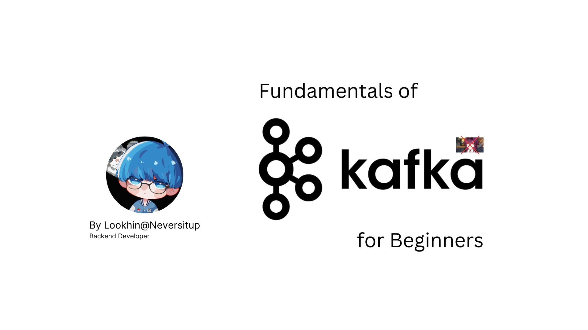

<h1>Neversitup Kafka Laboratory</h1>



<h2>🐳 Start Project</h2>

```bash
docker compose up -d
```


<h2>📑 Kafka Command</h2>

<p>Enter into the Kafka container</p>

```bash
docker exec -it my-kafka bash
```

<p>Create a topic</p>

```bash
./opt/bitnami/kafka/bin/kafka-topics.sh --create --topic order --replication-factor 1 --partitions 1 --bootstrap-server localhost:9092
```

<p>See all topics list</p>

```bash
./opt/bitnami/kafka/bin/kafka-topics.sh --describe --topic order --bootstrap-server localhost:9092
```

<p>Write a message into the topic</p>

```bash
./opt/bitnami/kafka/bin/kafka-console-producer.sh --topic order --bootstrap-server localhost:9092
```

<p>Read a message on that topic</p>

```bash
./opt/bitnami/kafka/bin/kafka-console-consumer.sh --topic order --from-beginning --bootstrap-server localhost:9092
```

<p>Delete topic</p>

```bash
./opt/bitnami/kafka/bin/kafka-topics.sh --delete --bootstrap-server localhost:9092 --topic quickstart-events
```